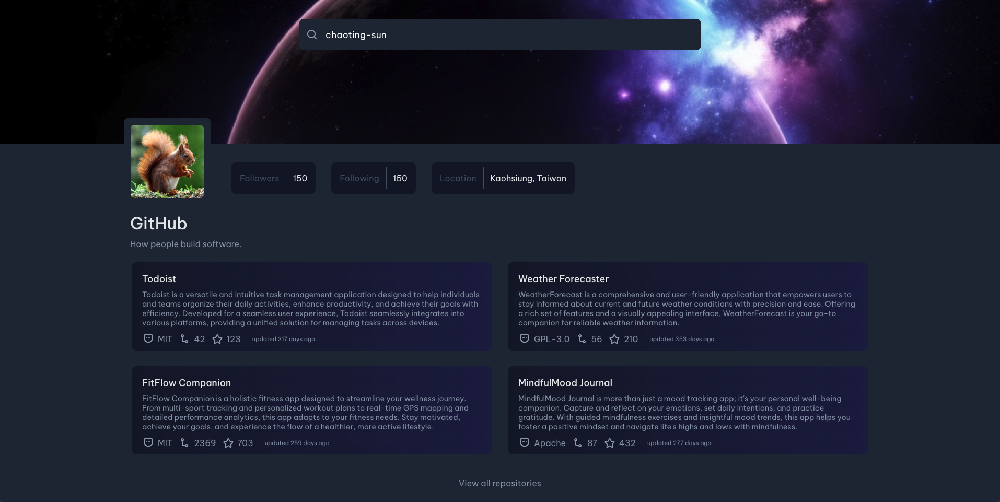

# Github Profile - TypeScript


## Welcome! 👋

**Github Profile** is a front-end coding challenge in [devChallenges](https://devchallenges.io/) platform which helps improve coding skills by building realistic projects.

## The challenge

The **Github Profile** has the following function:

- Search for any Github account and show the personal profile
- The personal profile includes an avatar, user information, and repositories
- Show more or few repositories by clicking the footer buttom
- Clicking a repository card will navigate to its website

## Applied Skills

- HTML5
- CSS
- Javascript
- React
- Material UI
- styled components
- JSON Server
- Axios
- Vite

## Run Locally

install the repository and the related libraries.

```bash
git clone git@github.com:chaoting-sun/github-profile-ts.git
cd github-profile-ts
npm install
```

start the frontend and backend.

```bash
npm run dev
npm run server # in another terminal
```